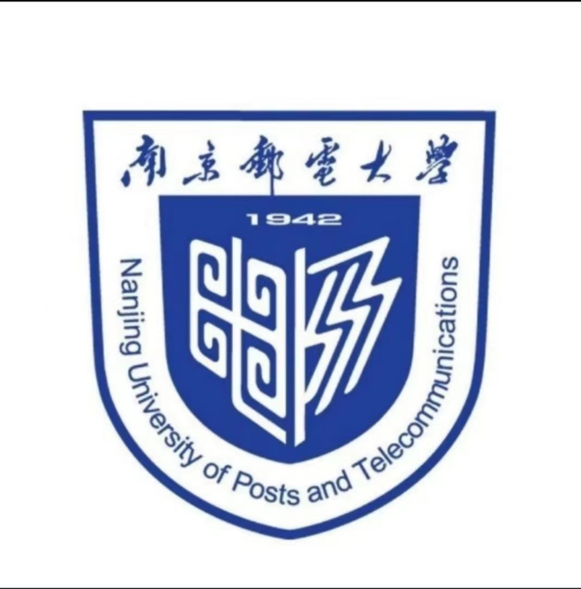

  

  南京邮电大学飞跃手册

## 引言

感谢阅读南邮飞跃手册。

**加入南邮留学群:586506342**

当我第一次翻开上海交大飞跃手册时，心中顿时涌起千般感慨。南邮有那么多精通前端的同学和校友，我们为何没有一个便捷的信息交流平台呢？于是，从来未接触过前端的我决定模仿上海交大的开源项目，创建了这个略显简陋的手册，希望其中的内容能为你带来一丝帮助。

针对留学生的所有服务都是具有商业价值的，但我不愿意让这本由多位热心学长学姐倾注心血编写的手册，沦为各大中介机构的广告渠道。因此**本网站的所有分享严禁出现依靠中介“华丽包装”来提升自身实力并获得名校认可的案例**,请不要在分享中提及任何中介机构的名称。中介如同那浮华的泡沫，无法真正提升你的学习水平。请不要被他们的空洞承诺所迷惑。具体内容请参考<a href="https://github.com/SurviveSJTU/SurviveSJTUManual/blob/master/fang-tan-ji/untitled/jing-ti-chu-guo-zhong-jie.md">上海交通大学生存手册中的“警惕留学中介”</a>板块。

### 板块说明

**早期阶段项目内保留了一部分南科大同学的投稿作为样本以供参考，新投稿可根据自己的隐私需求做1.背景和申请结果等投稿人认为较为敏感的部分(姓名，成绩，性别，GT等)做模糊化处理2.选择性留邮箱或者其他投稿人觉得有利于保护自己隐私的方法，分享申请/找工作前的一些准备流程以及后续的硕博就读或者在公司就业的经历感悟应该是更重要的部分**，可以是分享一些对本科研领域目前的认知或者是在公司某类型岗位的工作经历，帮助小朋友们了解不同前路的“路况”，避免重复踩坑。同时我们关注到国内大学普遍存在批量生产毕业生而忽略对后50%的同学的关怀，本飞跃手册欢迎**所有的毕业生**分享你们的故事，不限出路、不限水平。你的分享一定会帮助到某些未来的小朋友们。

鉴于大多数同学申请的是EE和CS学院，我们将板块分为EE&CS申请和其他专业申请。其中，EE&CS申请又细分为PhD&研究型硕士申请和授课型硕士申请两个部分。希望这些分类详尽的信息，能如同点亮前路的灯塔，照亮你的申请之路，助你追逐梦想。

1. 对于没有Git使用背景的大部分同学：请将编辑好的`Word`/`Pages`文件发送到**1792535744@qq.com**，我会帮助你上架。
2. 对于熟悉Git操作的同学：请对[`docs`](https://github.com/SurviveNJUPT/NJUPT-Application/tree/master/docs)路径下的对应文件夹Pull Request，可参考 ['doc']文件夹下的 **《如何进行经验分享》**，Merge后便即时上线。请注意文件名请全部使用英文并符合之前的模板，不允许有空格，请使用-代替空格。
3. 如需更新内容，请及时联系我们！